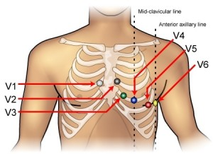

# MAM2ADMM-Series00-Git-MyGitHubLoubnaElf_student
This repository is used to learn the basics of Git and GitHub
Hello ! This repository to learn the basics of Git and GitHub and to improve my skills. 

 

